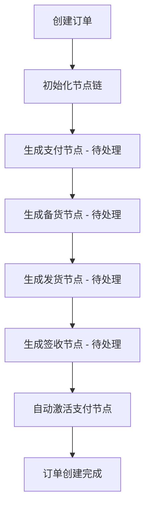
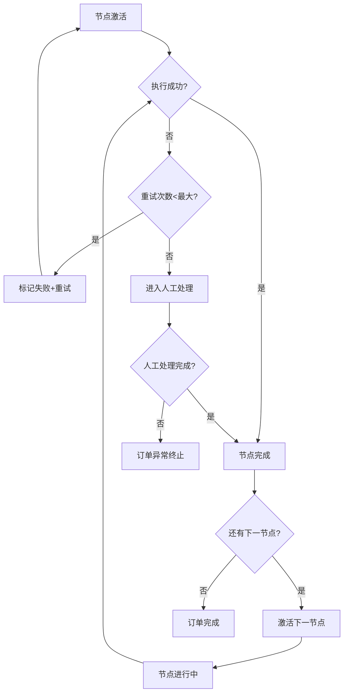
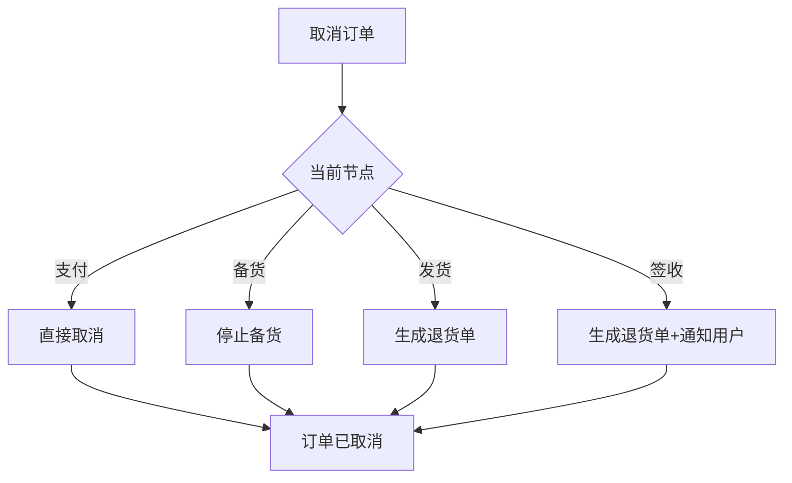

# 订单履约节点系统 PRD

## 1. 产品概述

订单履约节点系统是一个用于管理和跟踪订单全生命周期的可视化管理系统。系统通过节点化的方式将订单履约流程拆解为多个可管理、可监控的阶段，实现订单流程的自动化推进、异常监控和风险预警。目标用户为电商平台的运营人员、仓库管理人员和客服团队。

系统提供直观的可视化界面，实时展示订单状态、节点进度和异常预警，帮助运营团队及时发现和处理订单问题，提升订单履约效率和服务质量。

## 2. 核心功能

### 2.1 订单管理

#### 2.1.1 订单创建与初始化
- 支持手动创建订单，包含订单号、商品信息、收货地址等基本字段
- 订单创建后自动初始化履约节点链：支付待处理 → 备货中 → 发货中 → 签收完成
- 每个节点包含状态（待处理/进行中/已完成/失败/超时）、创建时间、预计完成时间、实际完成时间等属性

#### 2.1.2 订单列表展示
- 展示所有订单的列表视图，支持按状态、风险等级、创建时间等维度筛选
- 列表项显示订单号、当前节点、状态、风险等级、创建时间等关键信息
- 支持订单详情查看，包括完整节点链和操作日志

### 2.2 节点管理

#### 2.2.1 节点状态流转
- 节点状态包括：待处理（pending）、进行中（processing）、已完成（completed）、失败（failed）、超时（timeout）
- 节点严格按顺序执行，前置节点未完成时后续节点不可执行
- 节点完成后自动触发下一个节点的执行

#### 2.2.2 节点超时管理
- 每个节点预设超时时间：支付（30分钟）、备货（24小时）、发货（48小时）、签收（7天）
- 节点超时自动更新为超时状态，生成预警信息
- 超时节点影响订单风险等级：低风险 → 中风险 → 高风险 → 紧急

#### 2.2.3 节点重试机制
- 失败节点支持手动重试，设置最大重试次数（默认3次）
- 重试次数耗尽后节点进入人工处理状态
- 人工处理状态需要人工确认后才能继续或标记为终态

### 2.3 补偿逻辑

#### 2.3.1 订单取消补偿
- 用户取消订单时，根据当前节点执行相应的补偿逻辑
- 支付完成前：直接取消，无需补偿
- 备货中：通知仓库停止备货，标记取消
- 已发货：生成退货单，记录物流信息，标记待退货
- 已签收：生成退货单，通知用户寄回商品

#### 2.3.2 补偿状态跟踪
- 补偿操作记录完整的补偿日志
- 补偿完成后订单进入已取消状态

### 2.4 定时任务

#### 2.4.1 节点状态扫描
- 每分钟扫描所有订单节点状态
- 检测处于"进行中"状态超过预期的节点（卡住检测）
- 检测即将超时的节点（提前1小时预警）

#### 2.4.2 超时节点处理
- 节点超时后自动更新状态和风险等级
- 生成系统预警通知
- 记录超时日志

### 2.5 预警管理

#### 2.5.1 预警类型
- 超时预警：节点即将超时或已超时
- 卡住预警：节点长时间无进展
- 失败预警：节点重试后仍失败
- 风险升级预警：订单风险等级提升

#### 2.5.2 预警展示
- 实时显示所有未处理的预警
- 支持预警确认和处理操作
- 预警处理后记录处理人和处理时间

### 2.6 预计完成时间

#### 2.6.1 时间计算规则
- 正常情况下，预计完成时间 = 当前节点预计完成时间 + 各后续节点平均处理时间
- 节点异常（失败/超时）时，预计完成时间动态调整：
  - 失败未恢复：增加2小时
  - 超时：增加5小时
  - 人工处理中：显示"待定"，需人工评估

#### 2.6.2 时间展示
- 订单列表显示预计完成时间
- 订单详情页显示详细的时间线

## 3. 核心流程

## 3.1 订单创建流程

## 3.2 节点执行流程

## 3.3 订单取消流程

## 4. 用户界面设计

### 4.1 设计风格

#### 4.1.1 视觉风格
- 采用现代简洁的企业级管理后台风格
- 主色调：深蓝色（#1a73e8）配合浅灰色背景（#f8f9fa）
- 强调色：成功绿（#34a853）、警告橙（#fbbc04）、错误红（#ea4335）
- 卡片式布局，圆角设计，阴影效果增强层次感

#### 4.1.2 字体与排版
- 主字体：思源黑体（Noto Sans SC）或系统默认
- 标题：18-24px，字重600
- 正文：14-16px，字重400
- 标签：12px，字重500

#### 4.1.3 图标与状态
- 使用线性图标风格，简洁明了
- 节点状态用不同颜色和图标区分：
  - 待处理：灰色圆圈
  - 进行中：蓝色旋转动画
  - 已完成：绿色勾选
  - 失败：红色叉号
  - 超时：橙色警告三角
  - 人工处理：紫色人像图标

### 4.2 页面设计

#### 4.2.1 订单列表页
- **顶部操作栏**：创建订单按钮、状态筛选、搜索框、风险等级筛选
- **统计卡片**：总订单数、今日新增、待处理预警、平均处理时长
- **订单表格**：
  - 列：订单号、商品信息、当前节点、状态、风险等级、预计完成时间、操作
  - 行内操作：详情、重试、取消
  - 状态标签：彩色标签区分不同状态
- **分页组件**：支持每页条数选择和页码跳转

#### 4.2.2 订单详情页
- **基本信息区**：订单号、创建时间、风险等级、预计完成时间
- **节点进度图**：
  - 横向时间轴展示四个节点
  - 当前节点高亮显示
  - 已完成节点显示完成时间
  - 失败/超时节点显示异常标记
- **节点详情面板**：
  - 当前节点详细信息
  - 最近10条操作日志
  - 重试按钮（如适用）
- **补偿操作区**：
  - 取消订单按钮
  - 补偿状态显示（如有）
- **预警信息区**：
  - 当前订单所有预警列表
  - 预警处理操作

#### 4.2.3 预警中心
- **预警列表**：
  - 按时间倒序展示所有预警
  - 支持按类型、状态筛选
  - 快速处理操作
- **预警统计**：今日预警数量、类型分布、解决率

### 4.3 响应式设计
- 桌面端优先设计，支持平板和移动端查看
- 移动端采用卡片式布局，减少表格使用
- 触控友好的按钮尺寸和间距

## 5. 数据指标

### 5.1 关键指标
- **订单履约率**：按时完成的订单 / 总订单数
- **平均履约时长**：从创建到签收的平均时间
- **节点超时率**：超时节点数 / 总节点数
- **预警解决率**：已解决预警 / 总预警数
- **订单取消率**：取消订单数 / 总订单数

### 5.2 展示方式
- 首页统计卡片实时展示关键指标
- 支持时间范围筛选（今日、本周、本月）
- 图表展示趋势变化

## 6. 非功能性需求

### 6.1 性能需求
- 页面加载时间 < 2秒
- 节点状态更新延迟 < 1秒
- 定时任务执行时间 < 5秒

### 6.2 可用性需求
- 系统可用性 > 99.5%
- 支持同时在线用户数 > 100

### 6.3 数据持久化
- 所有数据存储在本地内存
- 使用 Java 的 ConcurrentHashMap 保证并发安全
- 应用重启后数据清空（按需求）
