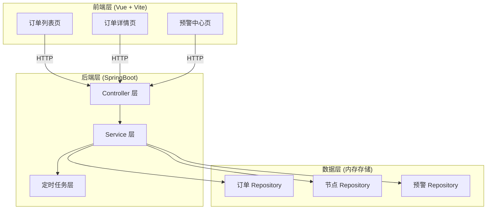

# 订单履约节点系统技术架构文档

## 1. 架构设计



## 2. 技术栈

### 2.1 前端技术栈
- **框架**：Vue 3 + Composition API
- **构建工具**：Vite 5
- **HTTP 客户端**：Axios
- **路由**：Vue Router 4
- **状态管理**：Pinia
- **UI 框架**：无，使用自定义组件
- **图表**：无，纯 CSS + HTML 实现节点图

### 2.2 后端技术栈
- **框架**：Spring Boot 2.7.x
- **Java 版本**：Java 8
- **Web 框架**：Spring MVC
- **定时任务**：Spring @Scheduled
- **并发集合**：java.util.concurrent.ConcurrentHashMap
- **JSON 处理**：Jackson

### 2.3 项目结构

```
项目根目录
├── backend/              # SpringBoot 后端
│   ├── src/
│   │   └── main/
│   │       ├── java/com/order/fulfillment/
│   │       │   ├── controller/
│   │       │   │   └── OrderController.java
│   │       │   ├── service/
│   │       │   │   ├── OrderService.java
│   │       │   │   ├── NodeService.java
│   │       │   │   └── AlertService.java
│   │       │   ├── model/
│   │       │   │   ├── Order.java
│   │       │   │   ├── FulfillmentNode.java
│   │       │   │   └── Alert.java
│   │       │   ├── repository/
│   │       │   │   ├── OrderRepository.java
│   │       │   │   ├── NodeRepository.java
│   │       │   │   └── AlertRepository.java
│   │       │   ├── config/
│   │       │   │   └── WebConfig.java
│   │       │   └── FulfillmentApplication.java
│   │       └── resources/
│   │           └── application.yml
│   └── pom.xml
│
└── frontend/             # Vue 前端
    ├── src/
    │   ├── components/
    │   │   ├── OrderList.vue
    │   │   ├── OrderDetail.vue
    │   │   ├── NodeProgress.vue
    │   │   └── AlertCenter.vue
    │   ├── views/
    │   │   ├── OrderListPage.vue
    │   │   └── OrderDetailPage.vue
    │   ├── services/
    │   │   └── api.js
    │   ├── stores/
    │   │   └── orders.js
    │   ├── App.vue
    │   └── main.js
    ├── index.html
    ├── package.json
    └── vite.config.js
```

## 3. 后端设计

### 3.1 数据模型

#### 3.1.1 订单模型 (Order)
```java
public class Order {
    private String orderId;                    // 订单ID (UUID)
    private String orderNumber;                 // 订单号
    private String productInfo;                 // 商品信息
    private String shippingAddress;             // 收货地址
    private OrderStatus status;                 // 订单状态
    private RiskLevel riskLevel;                // 风险等级
    private LocalDateTime createTime;           // 创建时间
    private LocalDateTime estimatedCompleteTime; // 预计完成时间
    private String currentNodeId;               // 当前节点ID
    private List<String> nodeIds;               // 节点ID列表
    private boolean cancelled;                  // 是否已取消
    private String cancellationReason;          // 取消原因
    private List<CompensationRecord> compensations; // 补偿记录
}
```

#### 3.1.2 履约节点模型 (FulfillmentNode)
```java
public class FulfillmentNode {
    private String nodeId;                      // 节点ID
    private String orderId;                     // 订单ID
    private NodeType type;                      // 节点类型
    private NodeStatus status;                  // 节点状态
    private int maxRetries;                    // 最大重试次数
    private int retryCount;                    // 当前重试次数
    private LocalDateTime startTime;            // 开始时间
    private LocalDateTime estimatedCompleteTime; // 预计完成时间
    private LocalDateTime actualCompleteTime;   // 实际完成时间
    private String errorMessage;                // 错误信息
    private List<OperationLog> operationLogs;   // 操作日志
    private String previousNodeId;              // 前置节点ID
    private String nextNodeId;                  // 下一节点ID
}
```

#### 3.1.3 预警模型 (Alert)
```java
public class Alert {
    private String alertId;                    // 预警ID
    private String orderId;                    // 订单ID
    private String nodeId;                     // 节点ID
    private AlertType type;                    // 预警类型
    private AlertLevel level;                  // 预警级别
    private String message;                    // 预警信息
    private LocalDateTime createTime;          // 创建时间
    private boolean resolved;                  // 是否已解决
    private String resolvedBy;                 // 处理人
    private LocalDateTime resolvedTime;        // 处理时间
}
```

#### 3.1.4 枚举定义
```java
// 订单状态
public enum OrderStatus {
    PENDING,      // 待处理
    PROCESSING,   // 处理中
    COMPLETED,    // 已完成
    CANCELLED,    // 已取消
    EXCEPTION     // 异常
}

// 节点类型
public enum NodeType {
    PAYMENT,      // 支付
    PREPARING,    // 备货
    SHIPPING,     // 发货
    SIGNED        // 签收
}

// 节点状态
public enum NodeStatus {
    PENDING,      // 待处理
    PROCESSING,   // 进行中
    COMPLETED,    // 已完成
    FAILED,       // 失败
    TIMEOUT,      // 超时
    MANUAL        // 人工处理
}

// 风险等级
public enum RiskLevel {
    LOW,          // 低风险
    MEDIUM,       // 中风险
    HIGH,         // 高风险
    CRITICAL      // 紧急
}

// 预警类型
public enum AlertType {
    TIMEOUT,      // 超时预警
    STUCK,        // 卡住预警
    FAILURE,      // 失败预警
    RISK_UP       // 风险升级
}

// 预警级别
public enum AlertLevel {
    INFO,         // 信息
    WARNING,      // 警告
    ERROR,        // 错误
    CRITICAL      // 严重
}
```

### 3.2 API 定义

#### 3.2.1 订单相关接口

**创建订单**
- **POST** `/api/orders`
- **Request Body**:
```json
{
  "productInfo": "商品信息",
  "shippingAddress": "收货地址"
}
```
- **Response**:
```json
{
  "code": 200,
  "message": "订单创建成功",
  "data": {
    "orderId": "订单ID",
    "orderNumber": "ORD20260101001"
  }
}
```

**获取订单列表**
- **GET** `/api/orders`
- **Query Parameters**:
  - `status`: 订单状态（可选）
  - `riskLevel`: 风险等级（可选）
  - `page`: 页码（默认0）
  - `size`: 每页条数（默认10）
- **Response**:
```json
{
  "code": 200,
  "message": "success",
  "data": {
    "content": [
      {
        "orderId": "订单ID",
        "orderNumber": "ORD20260101001",
        "status": "PROCESSING",
        "riskLevel": "LOW",
        "currentNodeType": "PREPARING",
        "estimatedCompleteTime": "2026-01-05T12:00:00",
        "createTime": "2026-01-01T10:00:00"
      }
    ],
    "totalElements": 100,
    "totalPages": 10
  }
}
```

**获取订单详情**
- **GET** `/api/orders/{orderId}`
- **Response**:
```json
{
  "code": 200,
  "message": "success",
  "data": {
    "order": {
      "orderId": "订单ID",
      "orderNumber": "ORD20260101001",
      "productInfo": "商品信息",
      "shippingAddress": "收货地址",
      "status": "PROCESSING",
      "riskLevel": "MEDIUM",
      "createTime": "2026-01-01T10:00:00",
      "estimatedCompleteTime": "2026-01-05T12:00:00",
      "cancelled": false,
      "compensations": []
    },
    "nodes": [
      {
        "nodeId": "节点ID",
        "type": "PAYMENT",
        "status": "COMPLETED",
        "startTime": "2026-01-01T10:00:00",
        "actualCompleteTime": "2026-01-01T10:05:00",
        "operationLogs": []
      }
    ]
  }
}
```

**取消订单**
- **POST** `/api/orders/{orderId}/cancel`
- **Request Body**:
```json
{
  "reason": "取消原因"
}
```
- **Response**:
```json
{
  "code": 200,
  "message": "订单已取消",
  "data": {
    "cancelled": true,
    "compensationExecuted": true,
    "compensationType": "GENERATE_RETURN"
  }
}
```

#### 3.2.2 节点相关接口

**重试节点**
- **POST** `/api/nodes/{nodeId}/retry`
- **Response**:
```json
{
  "code": 200,
  "message": "节点已重新执行",
  "data": {
    "nodeId": "节点ID",
    "status": "PROCESSING",
    "retryCount": 2
  }
}
```

**手动完成节点**
- **POST** `/api/nodes/{nodeId}/complete`
- **Response**:
```json
{
  "code": 200,
  "message": "节点已完成",
  "data": null
}
```

#### 3.2.3 预警相关接口

**获取预警列表**
- **GET** `/api/alerts`
- **Query Parameters**:
  - `type`: 预警类型（可选）
  - `resolved`: 是否已解决（可选）
  - `page`: 页码（默认0）
  - `size`: 每页条数（默认10）
- **Response**:
```json
{
  "code": 200,
  "message": "success",
  "data": {
    "content": [
      {
        "alertId": "预警ID",
        "orderId": "订单ID",
        "nodeId": "节点ID",
        "type": "TIMEOUT",
        "level": "WARNING",
        "message": "支付节点已超时",
        "createTime": "2026-01-01T10:30:00",
        "resolved": false
      }
    ],
    "totalElements": 5,
    "totalPages": 1
  }
}
```

**处理预警**
- **POST** `/api/alerts/{alertId}/resolve`
- **Request Body**:
```json
{
  "resolvedBy": "处理人",
  "comment": "处理说明"
}
```
- **Response**:
```json
{
  "code": 200,
  "message": "预警已处理",
  "data": null
}
```

#### 3.2.4 统计接口

**获取统计数据**
- **GET** `/api/stats`
- **Response**:
```json
{
  "code": 200,
  "message": "success",
  "data": {
    "totalOrders": 100,
    "todayOrders": 10,
    "pendingAlerts": 5,
    "avgFulfillmentTime": 48.5,
    "timeoutRate": 0.05,
    "completionRate": 0.95
  }
}
```

### 3.3 定时任务设计

#### 3.3.1 节点扫描任务
- **执行频率**：每分钟执行一次
- **功能**：
  1. 扫描所有处于"进行中"状态的节点
  2. 检查节点是否超时，更新状态
  3. 检查节点是否卡住（超过预期时间2倍无进展）
  4. 自动推进可执行的节点

#### 3.3.2 预警生成任务
- **执行频率**：每分钟执行一次
- **功能**：
  1. 检测即将超时的节点（提前1小时）
  2. 生成超时预警
  3. 检测风险等级变化
  4. 生成风险升级预警

### 3.4 补偿逻辑设计

#### 3.4.1 补偿策略
```java
public class CompensationStrategy {
    // 根据节点类型执行补偿
    public static CompensationResult execute(NodeType currentNode) {
        switch (currentNode) {
            case PAYMENT:
                return new CompensationResult(CompensationType.NONE, "支付未完成，无需补偿");
            case PREPARING:
                return new CompensationResult(CompensationType.STOP_PREPARE, "已通知仓库停止备货");
            case SHIPPING:
                return new CompensationResult(CompensationType.GENERATE_RETURN, "已生成退货单");
            case SIGNED:
                return new CompensationResult(CompensationType.GENERATE_RETURN + NOTIFY_USER,
                                              "已生成退货单并通知用户");
            default:
                return new CompensationResult(CompensationType.NONE, "未知节点类型");
        }
    }
}
```

## 4. 前端设计

### 4.1 路由定义

| 路由 | 页面 | 说明 |
|------|------|------|
| `/` | OrderListPage | 订单列表页 |
| `/order/:id` | OrderDetailPage | 订单详情页 |
| `/alerts` | AlertCenter | 预警中心 |

### 4.2 组件设计

#### 4.2.1 OrderList.vue
- **功能**：订单列表展示和筛选
- **状态**：
  - `orders`: 订单列表
  - `loading`: 加载状态
  - `filters`: 筛选条件
  - `pagination`: 分页信息
- **事件**：
  - `@view`: 查看订单详情
  - `@cancel`: 取消订单
  - `@retry`: 重试节点

#### 4.2.2 OrderDetail.vue
- **功能**：订单详细信息和节点管理
- **状态**：
  - `order`: 订单详情
  - `nodes`: 节点列表
  - `loading`: 加载状态
- **事件**：
  - `@retry-node`: 重试节点
  - `@cancel-order`: 取消订单
  - `@complete-node`: 手动完成节点

#### 4.2.3 NodeProgress.vue
- **功能**：节点进度可视化展示
- **状态**：
  - `nodes`: 节点列表
  - `currentNodeId`: 当前节点ID
- **展示**：
  - 横向时间轴
  - 节点图标和状态
  - 完成时间标注

#### 4.2.4 AlertCenter.vue
- **功能**：预警列表和处理
- **状态**：
  - `alerts`: 预警列表
  - `filters`: 筛选条件
- **事件**：
  - `@resolve`: 处理预警

### 4.3 API 服务

```javascript
// services/api.js
import axios from 'axios';

const api = axios.create({
  baseURL: 'http://localhost:8005/api',
  timeout: 10000
});

// 订单相关
export const orderApi = {
  list: (params) => api.get('/orders', { params }),
  detail: (id) => api.get(`/orders/${id}`),
  create: (data) => api.post('/orders', data),
  cancel: (id, reason) => api.post(`/orders/${id}/cancel`, { reason })
};

// 节点相关
export const nodeApi = {
  retry: (nodeId) => api.post(`/nodes/${nodeId}/retry`),
  complete: (nodeId) => api.post(`/nodes/${nodeId}/complete`)
};

// 预警相关
export const alertApi = {
  list: (params) => api.get('/alerts', { params }),
  resolve: (alertId, data) => api.post(`/alerts/${alertId}/resolve`, data)
};

// 统计相关
export const statsApi = {
  get: () => api.get('/stats')
};
```

## 5. 预计完成时间计算

### 5.1 正常情况
```
预计完成时间 = 当前时间 + 各剩余节点平均处理时间
```

### 5.2 异常情况调整
- 节点失败（未恢复）：+2小时
- 节点超时：+5小时
- 人工处理中：标记为"待定"

### 5.3 实现逻辑
```java
public LocalDateTime calculateEstimatedTime(Order order, List<FulfillmentNode> nodes) {
    if (nodes.stream().anyMatch(n -> n.getStatus() == NodeStatus.MANUAL)) {
        return null; // 待定
    }

    long extraHours = 0;
    for (FulfillmentNode node : nodes) {
        if (node.getStatus() == NodeStatus.FAILED) {
            extraHours += 2;
        } else if (node.getStatus() == NodeStatus.TIMEOUT) {
            extraHours += 5;
        }
    }

    return LocalDateTime.now().plusHours(48 + extraHours); // 默认48小时 + 异常时间
}
```

## 6. 超时配置

| 节点类型 | 超时时间 | 提前预警时间 |
|---------|---------|-------------|
| 支付 | 30分钟 | 10分钟 |
| 备货 | 24小时 | 1小时 |
| 发货 | 48小时 | 2小时 |
| 签收 | 7天 | 1天 |

## 7. 启动配置

### 7.1 后端启动
- **端口**：8005
- **启动命令**：`mvn spring-boot:run` 或 `java -jar target/*.jar`
- **健康检查**：`http://localhost:8005/actuator/health`

### 7.2 前端启动
- **端口**：3005
- **开发服务器**：`npm run dev`
- **访问地址**：`http://localhost:3005`

### 7.3 跨域配置
后端已配置允许前端 origin: `http://localhost:3005` 的跨域请求。
